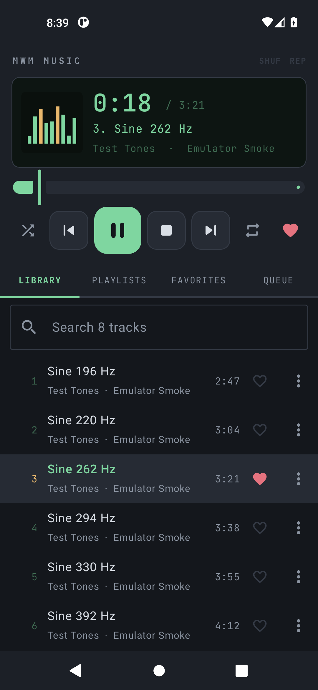

# MWM Music



A small, quiet music player for Android in the spirit of Winamp: a display, a
row of transport buttons, and a playlist underneath. It plays the audio files
that are on your phone. That is the whole job.

- **No ads, no account, no tracking.** The app does not even ask for the
  internet permission, so it has no way to phone anywhere.
- **Plays what Android can decode:** mp3, m4a/aac, flac, ogg, opus, wav and
  more.
- **Playlists:** create, rename, delete, reorder, and save the current queue or
  your favorites as a new list.
- **Favorites:** one tap on the heart, on any row or on the deck.
- **Keeps playing** with the screen off, with controls on the lock screen and
  in the notification shade. Pauses when headphones are unplugged.
- **Opens where you left it:** the last queue and track are restored on start.
- **"Open with"** from any file manager.

## 📲 Download

**[⬇ Latest APK](https://github.com/Matswm86/mwm-music/releases/download/latest/mwm-music-ef230f8.apk)**
&nbsp;·&nbsp; [all builds](https://github.com/Matswm86/mwm-music/releases)

Open the link on your phone, tap the file, and allow "install from this source"
when Android asks. Android 8.0 or newer (minSdk 26). The filename carries the
commit id on purpose, so your browser can never serve you a cached old build. If
the link 404s, a newer build has landed: grab the newest `mwm-music-*.apk` off
the releases page.

Debug-signed. Reinstalling over a build with a different signature means
uninstalling the old one first.

## Using it

| Tab | What is there |
|-----|---------------|
| LIBRARY | Every music file on the phone, with search across title, artist and album. Tap a row and the whole list becomes the queue, starting at that row. |
| PLAYLISTS | Your lists. Open one to play it, reorder it (Move up / Move down in a row's menu) or remove tracks. |
| FAVORITES | Everything you gave a heart. "Save as playlist" turns it into a list. |
| QUEUE | What is lined up right now. Jump to a row, remove one, or save the queue as a playlist. |

The deck on top never goes away: clock, scrolling title, album cover when the
file carries one, seek bar, previous / play / stop / next, shuffle, repeat
(off, all, one) and the heart for the playing track. Stop does what Winamp's
stop did: silence, and back to the start of the track.

Playlists and favorites are stored by file path in the app's private storage.
If you delete a music file, it drops out of the lists that named it; the list
itself stays.

## What it deliberately does not do

- No streaming, lyrics fetching, cover downloads or anything else that needs a
  network.
- The bars in the display are decoration. Reading the real audio spectrum on
  Android requires the microphone permission, and a music player has no
  business asking for it.
- No equalizer, no tag editor, no skins, no `.m3u` import or export (yet).

## The picture above

It is not a mock-up. Every CI build installs the APK on an Android emulator,
copies eight generated sine-wave mp3s onto it, taps one, and checks from the
view hierarchy that the deck switched to Pause, the clock left 0:00 and the
heart saved a favorite. The screenshot is taken at that moment, which is why
the library is full of test tones rather than anybody's music.

## Build

Kotlin, Jetpack Compose, AndroidX Media3 (ExoPlayer + MediaSession). JDK 17,
compileSdk 35.

```bash
./gradlew testDebugUnitTest assembleDebug
```

Every push to `main` is built by GitHub Actions
([workflow](.github/workflows/build-android.yml)), which publishes the APK to
the rolling `latest` release and rewrites the download link above.

## License

[MIT](LICENSE). The display font is JetBrains Mono, under the
[SIL Open Font License](licenses/JetBrainsMono-OFL.txt).
